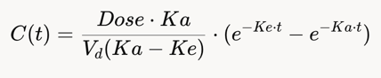

# pharmakinetix
Pharmacokinetics app

### 🧪 pk\_graph_generator.py
This script models drug concentration in the body using basic pharmacokinetic equations. You give it parameters like drug name, dose, absorption rate (Ka), and elimination rate (Ke), and it returns the concentration of the drug in the bloodstream over time. It's basically the backend logic for simulating how a drug moves through the body.

### 🧠 pk\_graph\_tool_ai.py
This one hooks GPT-4 and DrugBank into the process. It's a small app using Dash that lets someone type a natural-language prompt like *"Plot metformin at 500 mg"*. The app sends that prompt to GPT-4, which replies with Python code that simulates the drug data and builds a chart. The app runs the code and shows the resulting graph.

### 🌐 pk-visualizer.html
This is the front-end, a standalone HTML/JS tool. It works in the browser and doesn't need a backend. Users can type things like *"Show me wellbutrin xl at 300 mg"* and it instantly generates a drug concentration-over-time graph using Plotly. It uses hardcoded pharmacokinetic values for a couple of drugs and simulates the effect over 24 hours.

---

## Example prompts:
* show me 500 mg of metformin
* simulate 10 mg diazepam
* plot 100 µg fentanyl
* 100 mg of warfarin
* show me drug curve for 500 mg of amoxicillin
* 1 mg lorazepam
* 500mg ibuprofen

<!-- plot drug absorption -->
<!-- simulate concentration -->

---

## PK Formula

#### Pharmacokinetic Model

- **Dose**: User-provided (e.g., 500 mg).
- **Volume of Distribution (Vd)**: How the drug distributes in the body (assumed value for metformin, e.g., 100 L).
- **Clearance (Cl)**: How quickly the drug is removed (assumed value, e.g., 10 L/h).
- **Absorption Rate Constant (Ka)**: How quickly the drug is absorbed (e.g., 0.5 h^-1).
- **Elimination Rate Constant (Ke)**: How quickly the drug is eliminated (e.g., 0.1 h^-1).

The concentration over time can be modeled using the equation:

Where:

- \(C(t)\): Concentration at time \(t\).
- \(Dose\): Administered dose.
- \(Ka\): Absorption rate constant.
- \(Ke\): Elimination rate constant.
- \(Vd\): Volume of distribution.
- \(t\): Time.
